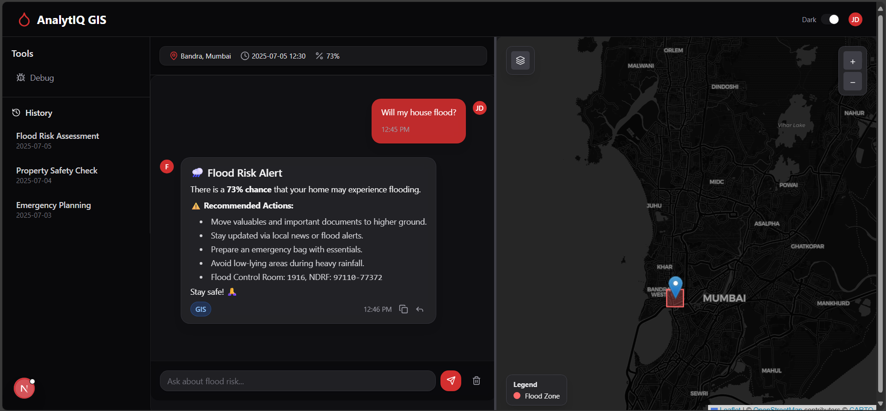
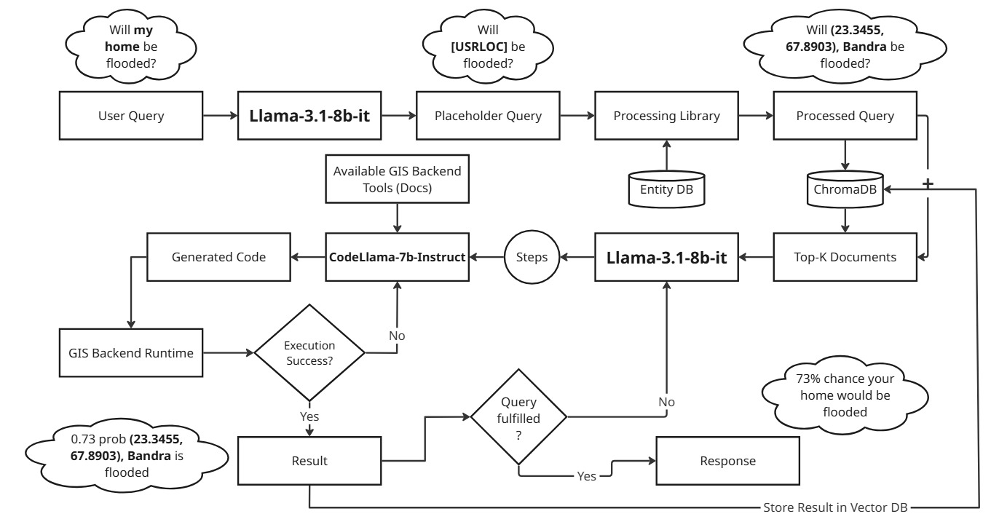
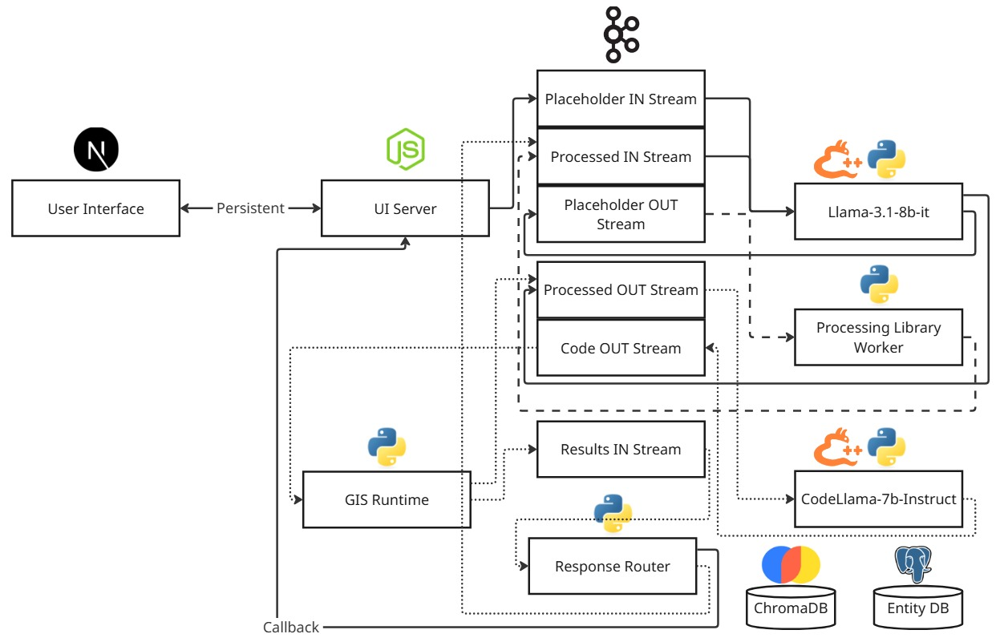

  

<h1 align="center">AnalytIQ GIS</h1>
AnalytIQ GIS is an AI-powered geospatial assistant that uses chain-of-thought reasoning in LLMs to solve complex spatial analysis tasks through dynamic geoprocessing. Users can ask natural-language questions like “Will my home be flooded?” and receive accurate, location-specific insights grounded in real geospatial data.
The system mimics a GIS expert’s reasoning by breaking down queries into logical steps, then executing them using code generated by `CodeLLaMA-7B-Instruct`, with language understanding powered by `LLaMA 3.1 8B Instruct` both models runnable on mid-tier GPUs.
With vector databases for context and entity resolution for geographic precision, the assistant makes spatial analysis conversational and accessible. Applications include flood risk assessment, urban planning, and disaster response shifting from manual tools to intelligent, language-driven workflows.

>**Note**: This project is currently under active development.

### General Workflow

### Architecture & Techstack

Techstack: Next.js, Express/NestJS, Apache Kafka, Llama.cpp-python, python, ChromaDB, Postgres, gRPC, Docker

### Setup
Will be updated soon.
