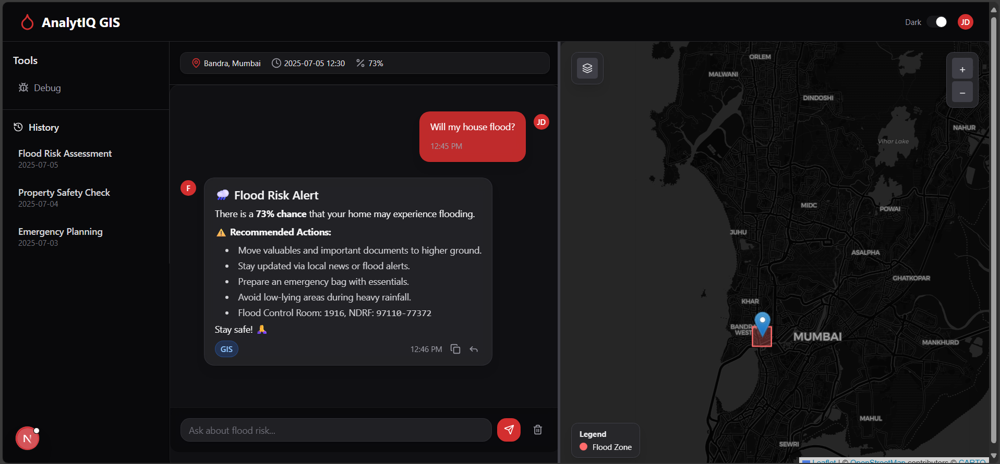
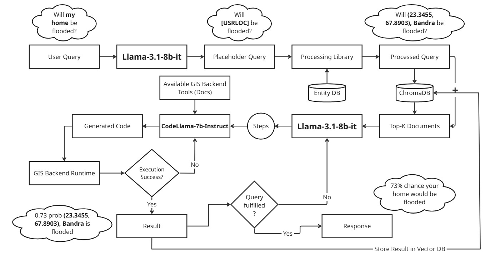
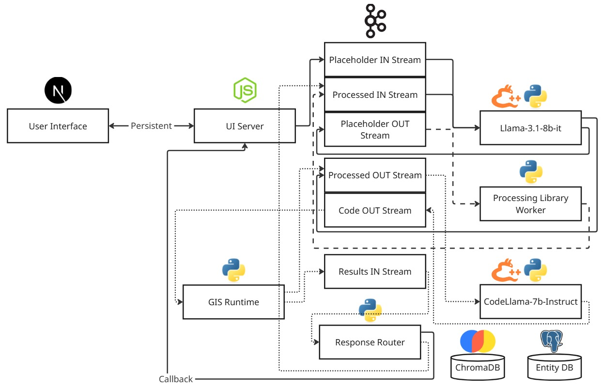

<p align="center">
  
</p>

<h1 align="center">AnalytIQ GIS</h1>
AnalytIQ GIS is an AI-powered geospatial assistant that uses chain-of-thought reasoning in LLMs to solve complex spatial analysis tasks through dynamic geoprocessing. Users can ask natural-language questions like “Will my home be flooded?” and receive accurate, location-specific insights grounded in real geospatial data.

The system mimics a GIS expert’s reasoning by breaking down queries into logical steps, then executing them using code generated by `CodeLLaMA-7B-Instruct` with language understanding powered by `LLaMA-3.1-8B-it-Q4_K_M` both models runnable on mid-tier GPUs (We are using a `Nvidia RTX 3050 4GB VRAM Laptop GPU + 16 GB RAM` for development). With vector databases for context and entity resolution for geographic precision, the assistant makes spatial analysis conversational and accessible. Applications include flood risk assessment, urban planning, and disaster response shifting from manual tools to intelligent, language-driven workflows.

**Techstack:** `Next.js`, `Express/NestJS`, `Apache Kafka`, `Llama.cpp-python`, `python`, `ChromaDB`, `Postgres`, `gRPC`, `Docker`

>**Note**: This project is currently under active development.



## General Workflow


### Architecture


## Features
- Combines the power of GIS Workflows and the ease of use of NLP into a single platform, allowing everyone to use GIS Workflows

- Enhances threat perception and allows the user to have a more clearer picture of what's going on (demonstrated in Workflow diagram above)

- System is accessible even when internet is down through a helpline number and `faster-whisper` for speech to text

- Easily extendable, code generation is constrained to use a specific exposed functional interface, new workflows can simply be added in the interface and the system can use it

## Setup
This project uses a monorepo structure. Please ensure you have:
- [Python](https://www.python.org/): Python 3.12.3
- [Poetry](https://python-poetry.org/): For python dependency management
- [NodeJS](https://nodejs.org/en): JavaScript Runtime (v20.18.0 (future version support not gurantteed))
- [Node Version Manager](https://github.com/nvm-sh/nvm): To manage multiple versions of NodeJS
- [pnpm](https://pnpm.io/): Faster and disk-space effecient alternative to `npm`, optional but recommended
- [Make](https://www.gnu.org/software/make/): For general project related workflows
- [Docker](https://www.docker.com/): For orchestration and deployment

1. Clone the repo:
```bash
git clone https://github.com/B4S1C-Coder/AnalytIQ-GIS.git && cd AnalytIQ-GIS
```
2. Install JavaScript dependencies:
```bash
pnpm install
```
3. Install Python dependencies:
```bash
poetry install
```
4. Download the respective `.gguf` files and place them into the respective `./models/<model-name>`, recommended to take the `.Q4_K_M.gguf` files only (link in [Model Credits](#model-credits))

## Model Credits
This project would not have been possible without the following quantized models:

- `Meta-Llama-3.1-8b-Instruct`: [bartowski/Meta-Llama-3.1-8B-Instruct-GGUF](https://huggingface.co/bartowski/Meta-Llama-3.1-8B-Instruct-GGUF/tree/main)
- `CodeLlama-7B-Instruct`: [TheBloke/CodeLlama-7B-Instruct-GGUF](https://huggingface.co/TheBloke/CodeLlama-7B-Instruct-GGUF/tree/main)
- `phi-2`: [TheBloke/phi-2-GGUF](https://huggingface.co/TheBloke/phi-2-GGUF/tree/main)